# Teoria dos Grafos (Graph Theory)

Teoria dos grafos é o estudo dos grafos, que são estruturas matemáticas usadas para modelar relações de pares entre objetos.

Dado G(V,E) (ou G(V,A)), grafos são feitos por nós V (vértices) e conectados por E/A (edges/arestas).

Alguns conceitos básicos de grafos antes de começar a listar os principais tipos:

- Grafo Conexo: Todos os vértices são acessíveis a partir de quaisquer outros vértices por meio de um caminho possível.
- Grafo Não-Conexo: Existe pelo menos um vértice onde não existe caminho para acessá-lo. Ou seja, existe um vértice isolado.
- Ciclo: É um caminho fechado onde o primeiro e o último vértice são iguais. Pode ser um subgrafo de um grafo maior.
- Grafo Cíclico: Consiste em apenas um ciclo de caminho fechado.
- Grafo Acíclico: Não possui ciclos.

# Direção dos Grafos

Existem duas orientações de grafos principais: os grafos direcionados (directed graphs) e os não direcionados (undirected graphs).

## Grafos não direcionados (Undirected Graphs)

### Sem Pesos

- Definição: Um grafo não-direcionado é um par ordenado $(V,E)$ tal que:
    - $V$ é um conjunto finito, e
    - $E \subseteq \{\{u,v\} \subseteq V : u \neq v\}$ (a primeira chave representa o conjunto de pares não ordenados de um vértice)

Um grafo não direcionado G(V,E) é um conjunto de vértices e arestas onde as arestas são "bidirecionais" (na verdade não é direcional de forma alguma, mas é como se fosse). Ou seja, para toda aresta {u,v}, é idêntica (=) a aresta {v,u} trivialmente, pois é um conjunto de pares, e em conjuntos a ordem não importa.

Normalmente é representado com apenas uma linha conectando dois nós. No caso de grafos não direcionados, todas as arestas são linhas.

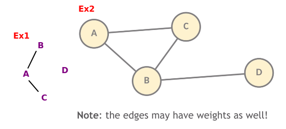

No caso do primeiro exemplo, o grafo desenhado é o grafo $G_1 = (V,E)$ tal que:

$V = \{A,B,C,D\}$, onde V é o conjunto de vértices.

$E = \{\{A,B\},\{A,C\}\}$, onde E é o conjunto de arestas (edges).

Observe que a definição anterior não permite:

- Mais de uma aresta entre dois vértices;
- Uma aresta ligando um vértice a si próprio;

### Com Pesos

- Definição: um grafo não-direcionado com pesos $w$ (nas arestas) é uma tupla $(V,E,w)$ tal que $(V,E)$ é um grafo não direcionado, e $w:E\to \mathbb{R}$.

$w$ é uma função que recebe uma aresta de um grafo e gera um output real, que é o o peso do grafo.

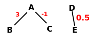

Em um grafo $G = (V,E)$:

- Os vértices são os elementos de V;
- As arestas são os eleentos de E;
- Uma aresta ${u,v}$ incide sobre $u$ e $v$, que são suas extremidades;
- A vizinhança aberta de um vértice $u$ é o conjunto dos seus vizinhos:
    - $N(u) = {v \in V : {u,v} \in E}$
- A vizinhança fechada de $u$ é:
    - $N'(u) = N(u) \cup {u}$
- O grau de um vértice $u$ é o número dos seus vizinhos
    - $d(u) = \left| N(u) \right|$ (cardinalidade vista em matemática discreta. Não é módulo).


## Grafos direcionados (Directed Graphs)

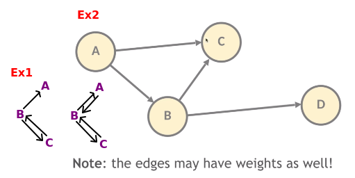

- Definição: um grafo direcionado é um par $(V,E) tal que:
    - $V$ é um conjunto finito;
    - $E \subseteq {(u,v) \in V\times V : u \neq v}$

Um grafo direcionado G(V,E) é um conjunto de vértices e arestas onde pelo menos uma aresta é unidimensional. Ou seja, existe uma aresta (u,v) e pode não existir uma aresta (v,u) ou não ser idêntica.

**Exemplo**

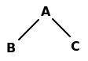

$V$ = {A,B,C}
$E$ = {(A,C),(A,B)}$
${(u,v) \in V\times V : u \neq v} = {(A,B),(B,A),(A,C),(C,A),(B,C),(C,B)}$

- Numa arsta (u,v), $u$ é a origem, $v$ é o destino, e a aresta é dita sair de $u$ e chegar em $v$;
- A vizinhança de saída de um vértice $u$ é $N^+(u) = {v \in V: (u,v) \in E}$
- A vizinhança de chegada é $N^-(u) = {v \in V : (v,u) \in E}$.
- O grau de saída é $d^+(u) = \left| N^+(u) \right|$ e o de chegada é $d^-(u) = \left| N^-(u) \right|$.

> Nota: aresta em grafos direcionados também são chamados de arcos. Arcos são arestas de um grafo direcionado.

## Algoritmo: descobrir o vértice de grau máximo

```python
    def vertice_de_grau_maximo(self):
        grau_maximo = -1
        vertice_grau_maximo = None

        for vertice in range(len(self.lista_adj)):
            grau = 0
            for aresta in self.lista_adj[vertice]:
                grau += 1
            if grau > grau_maximo:
                grau_maximo = grau
                vertice_grau_maximo = vertice

        return vertice_grau_maximo
```

# Propriedade dos Grafos

https://www.simplilearn.com/tutorials/data-structure-tutorial/graphs-in-data-structure

Aqui irei detalhar formalmente algumas definições sobre grafos e suas propriedades, e depois traduzo cada uma para uma linguagem mais informal.

### Grafo Simples e Múltiplo

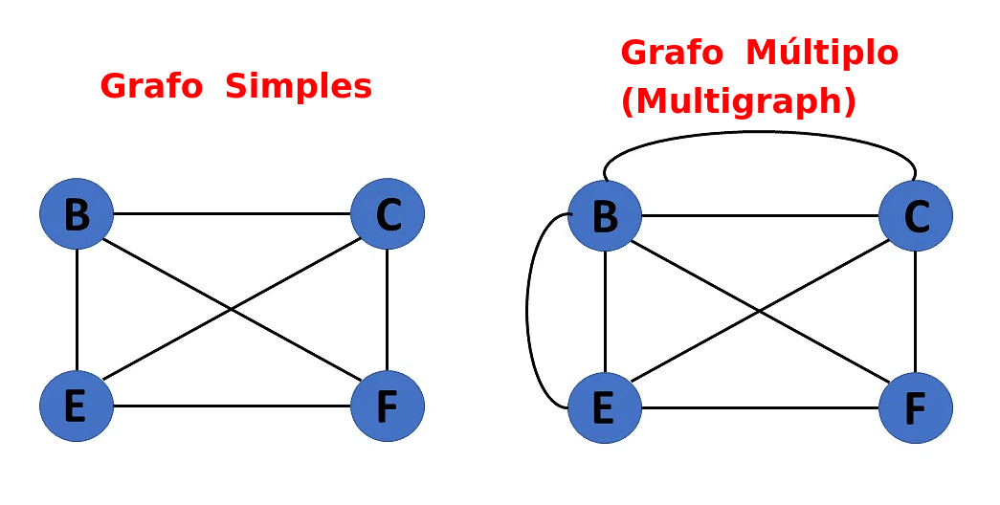

- **Grafo Simples:** Um grafo $G = (V, E)$ é chamado de simples se não possui loops e nem arestas paralelas. Formalmente, $G$ é simples se $E$ não contém arestas repetidas ou pares $(v,v)$ com $v \in V$.

Ou seja, se cada par de vértices no grafo tem só uma aresta, então é um grafo simples.

- **Grafo Múltiplo:** Um grafo $G = (V, E)$ é chamado de múltiplo se contém pelo menos uma aresta paralela. Formalmente, $G$ é múltiplo se existem pelo menos dois elementos distintos $e_1, e_2 \in E$ tais que $e_1 = (u, v)$ e $e_2 = (u, v)$.

Basicamente se tem multiplas arestas entre pares de vértices em um grafo, o grafo é um multigrafo. Porém, não existe loops no próprio vértice no multigrafo.

### Grafo Completo, Regular e Nulo

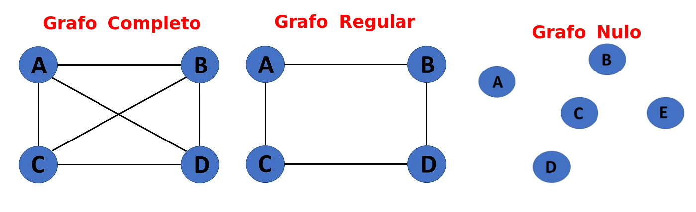

- **Grafo Completo:** Um grafo $G = (V, E)$ é chamado de completo se toda par de vértices distintos em $V$ é conectado por uma aresta em $E$. Formalmente, $G$ é completo se, para todo par de vértices distintos $u, v \in V$, temos $(u, v) \in E$.

Um grafo completo é um grafo simples. Basicamente todos os vértices são conectados a outros vértices, sem deixar nada sobrando, de tal forma que o grau de qualquer vértice precisa ser $num.vertices-1$ (pois ele não pode se autoconectar nesse caso).

- **Grafo Regular:** Um grafo $G=(V,E)$ é dito regular se todos os seus vértices têm o mesmo grau $k$, ou seja, se $\forall v_i \in V$, $\text{deg}(v_i) = k$, onde $\text{deg}(v_i)$ representa o grau do vértice $v_i$ e $k$ é um número inteiro fixo.

Sim, toda essa baboseira pra dizer que o grafo regular também é um grafo simples, e se ele tem graus iguais em todos os vértices, é um grafo regular.

- **Grafo Nulo:** Um grafo $G = (V, E)$ é chamado de nulo se não contém nenhuma aresta. Formalmente, $G$ é nulo se $E = \emptyset$.

A formalidade já é autoexplicativa. Se não existe arestas, então definimos como um grafo nulo.

### Caminho, Passeio e Distância

Dado um grafo $G = (V,E)$, não direcionado, e dados $u,v \in V$, temos:

- **Passeio de $u$ a $v$**: é uma sequẽncia de vértices $x_0, x_1,...,x_k$ tal que:
    - $k \ge 0$
    - $x_0 = u$ e $x_k = v$
    - Para todo $i \in \left\{1,...,k\right\}$, é válido que $\left\{x_{i-1}, x_i\right\} \in E$
- **Caminho de $u$ a $v$**: é um passeio de $u$ a $v$ sem repetição de vértices (exceto no começo e fim, definido por **caminho fechado**).
    - Ou seja, um passeio $x_0,...,x_k$ tal que para todo $i,j \in \left\{0,...,k\right\}$, se $i < j$, então $x_i \neq x_j$
- **Distância de $u$ a $v$**: é o mínimo entre os números de arestas dos caminhos de $u$ a $v$.
    - Ou seja, $\delta (u,v) = k_i$, se existe um caminho de $u$ a $v$ com $k$ arestas, e não existe caminho de $u$ a $v$ ccom menos de $k$ arestas. É infinito, se não existe caminho de $u$ a $v$.

Basicamente passeio é um percorrimento qualquer sobre um grafo. Um passeio precisa de uma aresta, nem que seja uma conectando ao próprio vértice. Os vértices podem se repetir quantas vezes forem preciso.

O caminho é um passeio em que os vértices não se repetem no meio da sequência de vértices. Ele pode se repetir somente do começo e final, e isso define o *caminho fechado*.

A distância de um vértice a outro é definido sempre como o menor caminho possível. E se não existir, é definido como uma distância infinita.

### Ciclo e Circuito

- **Circuito:** Um circuito em um grafo $G = (V, E)$ é um caminho fechado $v_0, e_1, v_1, e_2, \ldots, v_{k-1}, e_k, v_0$, onde $v_0, v_1, \ldots, v_{k-1}$ são vértices distintos e $e_1, e_2, \ldots, e_k$ são arestas distintas. O número de arestas $k$ é chamado de comprimento do circuito.

Basicamente um circuito é um caminho fechado em um grafo direcionado, mas o primeiro e o último vértice são iguais (ou seja, o caminho volta pro vértice inicial). Vértices podem se repetir.

- **Ciclo:** Um ciclo em um grafo $G = (V, E)$ é um circuito simples $v_0, e_1, v_1, e_2, \ldots, v_{k-1}, e_k, v_0$, onde $v_0, v_1, \ldots, v_{k-1}$ são vértices distintos e $e_1, e_2, \ldots, e_k$ são arestas distintas. O número de arestas $k$ é chamado de comprimento do ciclo.

Um ciclo é uma trilha que não passa por vértices ou arestas repetidos

### Grafo Cíclico e Acíclico

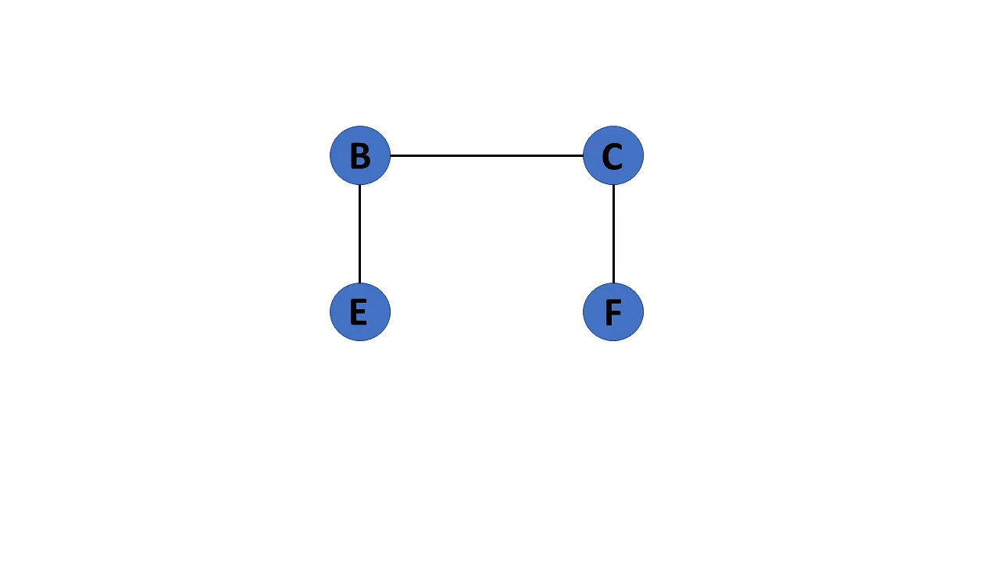

- **Grafo Cíclico:** Um grafo $G = (V,E)$ é dito cíclico se contém um ciclo, ou seja, se existe um caminho $v_1,e_1,v_2,e_2,\ldots,v_k,e_k,v_1$, onde $v_1,\ldots,v_k$ são vértices distintos e $e_1,\ldots,e_k$ são arestas distintas, tal que $v_i \neq v_j$ e $e_i \neq e_j$ para todo $i \neq j$.

Se um grafo contém pelo menos um Cíclo, então é um grafo cíclico.

### Grafo Conexo e Desconexo

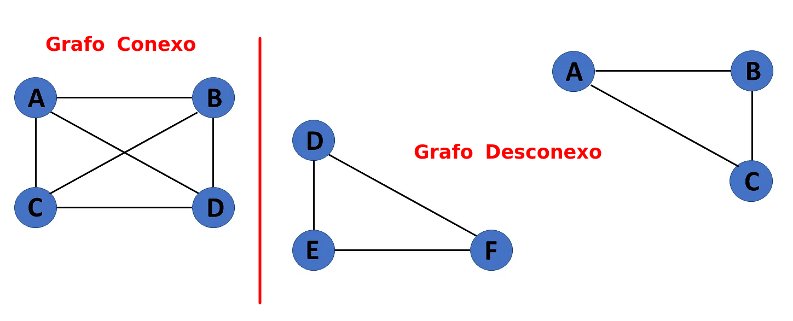

- **Grafo Conexo:** Um grafo $G = (V, E)$ é chamado de conexo se existe um caminho entre cada par de vértices distintos em $V$. Formalmente, $G$ é conexo se, para todo par de vértices distintos $u, v \in V$, existe um caminho que liga $u$ a $v$ em $G$.

Se existe um caminho entre um vértice de um grafo e qualquer outro vértice, o grafo é conexo.

- **Grafo Desconexo:** Um grafo $G = (V, E)$ é chamado de desconexo se não é conexo. Em outras palavras, $G$ é desconexo se existem pelo menos dois vértices em $V$ que não estão conectados por um caminho em $G$.

Ou seja, quando não existe uma aresta ligando um grupo de vértices a outros grupos.


# Tipos de Grafos 

## Árvores (Trees)

Árvore é um grafo não direcionado aciclico conexo.

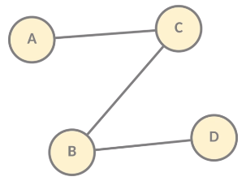

## Floresta (Forest)

Florestas são grafos onde todos os componentes conectados são árvores.

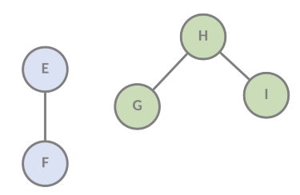

## Grafos acíclicos direcionados (Directed Acyclic Graph - DAG)

É um grafo finito direcionado sem 'ciclos direcionados' (crucial em muitos algoritmos).

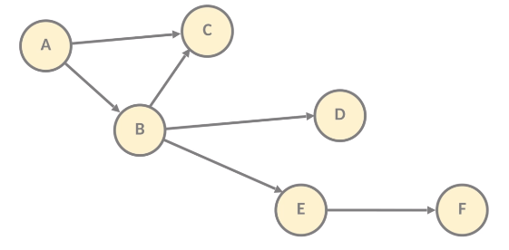

Se um grafo não possui ciclos, então dá pra resolver muitos problemas de forma muito rápida. Por exemplo, o algoritmo de menor caminho pode ser resolvido em tempo O(n) graças a isso.

## Grafo Completo (Complete Graph)

É um grafo onde todos os vértices se conectam entre si. Ou seja, todas as possibilidades de pares de vértices são possiveis e existentes no conjunto de arestas.

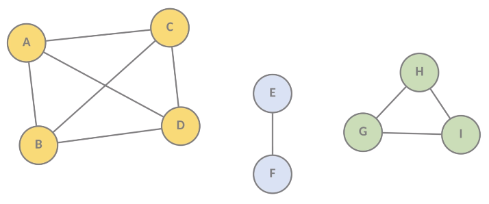

# Representação Computacional dos Grafos

- 1: Através dos problemas e algoritmos passados, nós observamos:
    - Nós precisamos conseguir percorrer os vértices e as arestas;
    - Dado um vértice qualquer, nós precisamos conseguir percorrer seus vizinhos;
    - É útil conhecer o número de vértices.

Além disso, nós ocasionalmente precisamos associar informações aos vértices (e então desejamos acessá-los de forma eficiente).

- 2: Estipulação - Daqui para a frente, nós vamos supor que, para qualquer grafo $G = (V,E)$, temos $V = {0,...,n-1}$, para algum $n \in \mathbb{N}$. Em outras palavras:
    - Nós denotaremos o número de vértices de algum grafo por $n$, facilitando menções a $\left| N^-(u) \right|$;
    - $m$ será o número de arestas;
    - Nós vamos supor que os vértices de um grafo são os números 0,1,...,n-1 , tornando imediato associar dados aos vértices (basta criar um vetor de $n$ elementos).

- 3: Discussão - Que estrutura de dados podemos usar para representar grafos, de forma a conseguir realizar de maneira eficiente as operações do item 1?

É aqui que entra duas formas de representar os grafos para trabalhar com algoritmos: Lista de Adjacências e Matriz de Adjacências.

## Lista de Adjacências (Adjacency List)

Nós atribuimos uma estrutura de dados (1D array) para cada vértice (nó) no grafo, e cada array guarda elementos que mostra a conexão (aresta) com outro vértice e o peso dessa conexão se o grafo tiver peso.

Podemos usar um vetor, e dentro dele, ponteiros para listas encadeadas, vetores ou quaisquer tipos de estrutura de dados (até mesmo árvores).

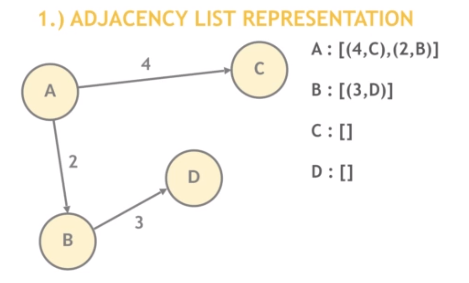

O uso de memória depende do número de arestas, o que pode salvar muita memória se a matriz de adjacências tiver bastante zeros. Ou seja, grafos dispersos é eficiente, mas grafos densos é ineficiente.

Buscar a aresta entre dois nós é O(k), onde k é o número de nós vizinhos. O fato é que mesmo sendo uma espécie de matriz (lista contendo lista), se você souber o índice (vértice), assintoticamente no pior caso é apenas 0(k), e não quadrático.

É rápido adicionar ou deletar um nó e é rápido iterar sobre todas as arestas, pois você pode acessar qualquer nó vizinho diretamente.

Na lista, podemos representar o peso da aresta como:

```cpp
class Noh{
    int vizinhos;
    double w; // Peso da aresta
}
```

Onde o vetor armazena ponteiros que apontam pro tipo Noh.

## Matriz de Adjacências (Adjacency Matrix)

Se constrói uma matriz M com tamanho VxV onde M[i][j] representa o peso da aresta ao ir do nó i para o nó j.

Por exemplo:

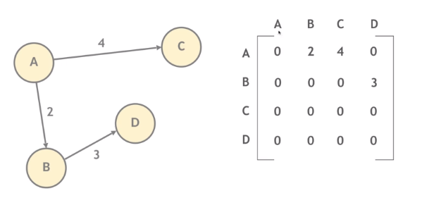

Observe os pesos que ocupam cada setor da matriz. Por ser um grafo direcional com pelo menos uma orientação única (ou seja, tem pelo menos um aresta de ida, mas não de volta), não existe simetria. Porém, observe esse caso:

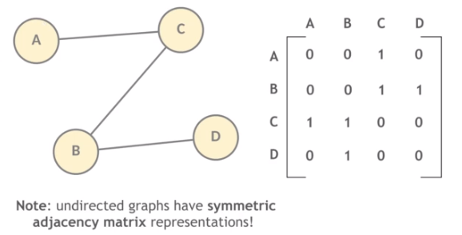

Aqui o grafo não possui peso, logo automaticamente se preenche os pesos da matriz com 1 ou 0, para indicar pelo menos a existência de uma aresta que conecta dois vértices.

E por se tratar de um grafo não-direcional, temos como resultado uma matriz com representação simétrica.

E por fim, se o grafo for direcional, mas bidirecional para toda aresta, ela também pode ter representação simétrica, desde que os pesos sejam iguais na ida e volta.

O uso de espaço é eficiente em grafos mais densos, mas requer memória O(V²) no pior caso.

Verificar o peso de uma aresta é O(1) se vocẽ tiver as coordenadas, e iterar sobre todas as arestas tem um custo de O(E²).

Na matriz, representamos os pesos substituido 1 pelo peso da aresta.

# Exercícios da disciplina

## Exercício da Aula 01

>Conteúdo: O que são Grafos: intuição, desenhos e definição de grafo não-direcionado.

**Alguns grafos podem ser desenhados no papel sem que qualquer aresta "cruze" (passe por cima de) outra; já para outros grafos, isso simplesmente não é possível: alguma aresta vai acabar cruzando outra, mesmo com a possibilidade de desenhar arestas curvadas. Procure então encontrar (usando apenas seu pensamento e desenhos) um grafo não-direcionado que você não consiga desenhar sem que alguma aresta cruze outra. Em seguida, rotule cada vértice com algum nome e então escreva a definição matemática desse grafo como um par (V,E) de vértices e arestas, conforme ensinado na aula de hoje.**

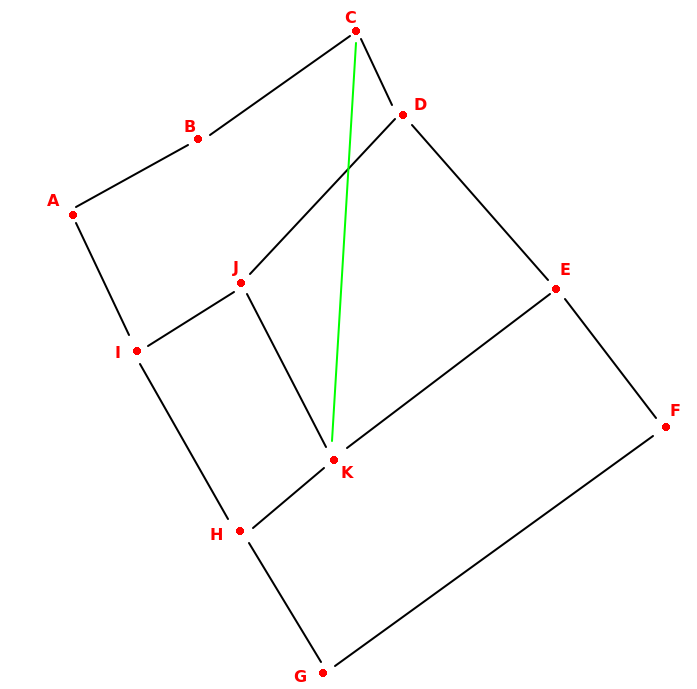

Esse grafo não direcionado G(V,E) é um conjunto de vértices e arestas tal que para toda aresta {u,v}, é idêntica (=) a aresta {v,u} trivialmente, pois é um conjunto de pares, e em conjuntos a ordem não importa.

$V = \{A,B,C,D,E,F,G,H,I,J\}$

$E = \{(A,B), (A,I), (B,C), (C,D), (C,K), (D,J), (D,E),(E,K),(E,F),(F,G),(G,H),(H,K),(H,I),(I,J),(J,K)\}$

## Exercício da Aula 02

>Conteúdo: Definição de Grafo Não-Direcionado (Recapitulação). Definição de Grafo Não-Direcionado Ponderado (nas Arestas). Terminologia Básica sobre Grafos Não-Direcionados. Definição de Grafo Direcionado. Terminologia Básica sobre Grafos Direcionados. Introdução à Manipulação Algorítmica de Grafos: Obtenção de Vértice de Grau Máximo.

**Seguindo o molde apresentado na aula de hoje, escreva um algoritmo que receba como entrada um grafo não-direcionado de pelo menos 3 vértices e que informe, através de um booleano, se ele se trata ou não de um grafo estrela.**

Ideia de um desenho: preciso verificar se o vértice do meio atende a uma regra: que ele seja conectado por todos os outros vértices, e os outros vértices NÃO podem se conectar entre si.

Ou seja, deve existir 1 e apenas 1 vértice que conecta todos, e o restante dos vértices não conectam entre si, somente ao vértice central. Se o algoritmo encontrar outro vértice que conecta a outro vértice aleatório, o grafo não é uma estrela.

Portanto, preciso verificar o conjunto de arestas de um vértice e ver se o grau dele bate com a $(quantidade de arestas) - 1$.

O algoritmo está no arquivo **grafos.py**.

## Exercício da Aula 03

>Conteúdo: Observação sobre operações típicas realizadas sobre grafos em algoritmos; Convenção sobre a natureza dos vértices dos grafos para daqui em diante; Estruturas de Dados para Representação de Grafos: Listas de Adjacências e Matriz de Adjacências (um estudante também acabou mencionando uma estrutura que é tradicionalmente conhecida como Matriz de Incidências, mas eu esqueci de mencionar esse fato no fim da discussão).
>Definições: passeio, caminho e distância (em grafos simples).

**Exercício para Casa da Aula 03 (1º Grande Problema da Disciplina): Pensando por conta própria, escreva um algoritmo que receba como entrada: Um grafo não-direcionado G = (V,E), com V = {0, ..., n-1}, e Um vértice o ∈ V ("origem"), e que então retorne um vetor d[0..n-1] tal que, para todo v ∈ V, d[v] = δ(o,v) (portanto, o algoritmo deve retornar um vetor com as distâncias de "o" a todos os outros vértices do grafo).**

Esse algoritmo é basicamente a busca em largura, onde você começa pela raíz (origem) e explora todos os vértices vizinhos.