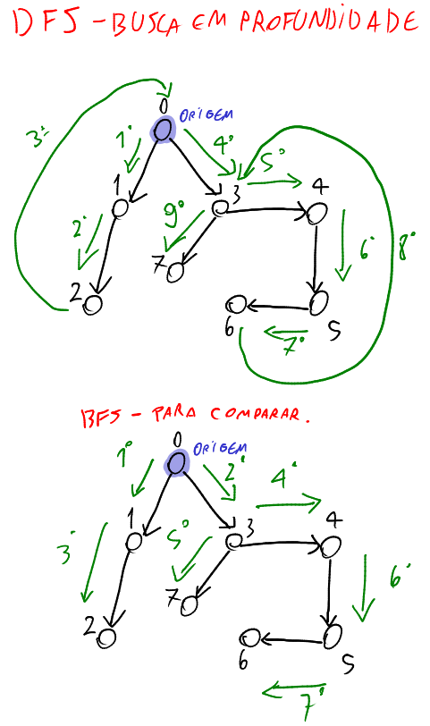

# Depth First Search - DFS (Busca em Profundidade)

A busca em profundidade é um algoritmo que usa uma pilha para "acumular" vizinhos a partir da origem, de tal forma que o caminho será feito até o último vértice possível, em profundidade.

