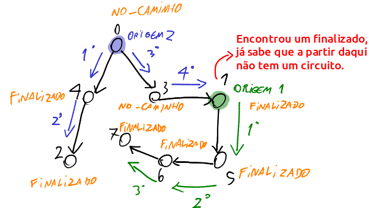

**Questão 1:**
É trivial que o vértice "vizinho" na chamada da função pode não fazer parte do caminho atual, pois o vizinho pode não ser o vértice inicial da pilha recursiva. Se esse for o caso, ele passa para a próxima condicional, onde continuará adicionando na chamada recursiva novos vizinhos a partir de novas origens, que é o antigo vizinho.

Portanto, existe 3 possibilidades:

- Se o vizinho está no_caminho_atual, existe um caminho do vértice "origem" até "vizinho", e portanto é detectado um circuito.

- Se o estado do vizinho for "não_atingido, significa que o vizinho não foi visitado, e a recursividade continua, estabelecendo uma nova origem como o "vizinho" atual, e o próximo vizinho como sendo o vizinho da nova origem. 

- Se o estado de vizinho for finalizado, então o vizinho já previamente foi explorado e não foi encontrado nenhum circuito a partir dele, portanto não faz nada. Exemplo:

E se nenhuma condicional for atingida, a função retorna false até a pilha esvaziar e passa para a próxima verificação a partir de uma nova origem no laço de "tem_circuito".

**Questão 2**

Caso 2: se o retorno vem da linha 14, então, como pela linha 13, existe pelo menos um vértice que não foi atingido, mas que na próxima chamada recursiva retornou verdadeiro, o que significa que em algum momento existirá um vértice vizinho a algum vértice no caminho futuro recursivo cujo estado estará ou pode estar atualmente "no_caminho_atual", e portanto existe um $i \in [0..k-1]$ tal que $x_i = vizinho$. Logo, $x_i,...,xk-1$ é um circuito.

**Questão 3**

Caso 3: se o retorno vem da linha 16, e todos os caminhos possíveis foram feitos partindo de todos os vértices do grafo (ou seja, todos os vértices foram finalizados,  e para isso é preciso que nenhum dos dois primeiros retornos da linha 12 e 14 sejam feitos), então não existe circuito.